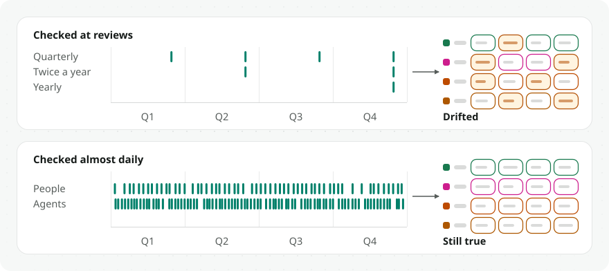
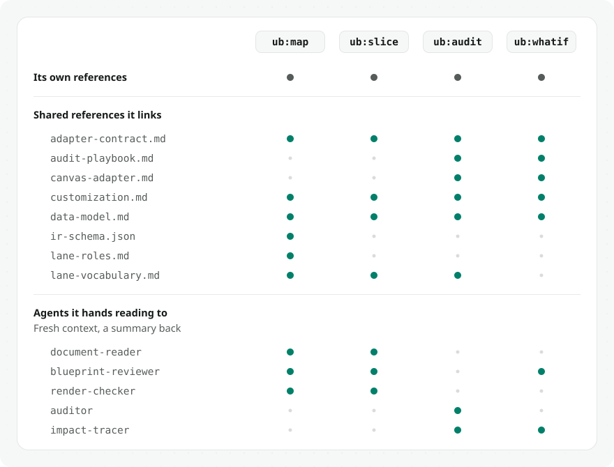
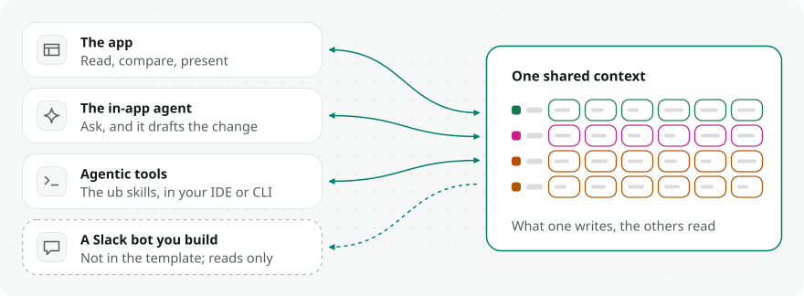
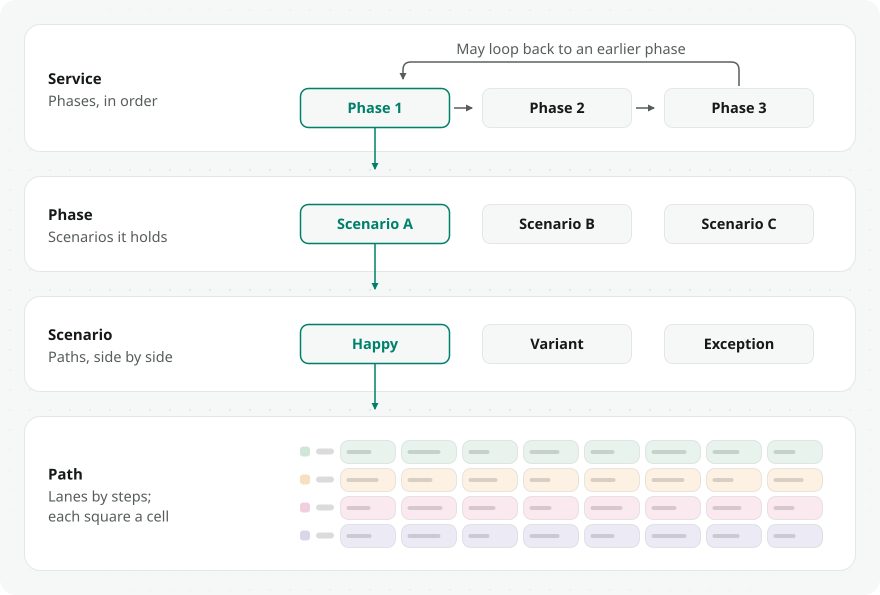
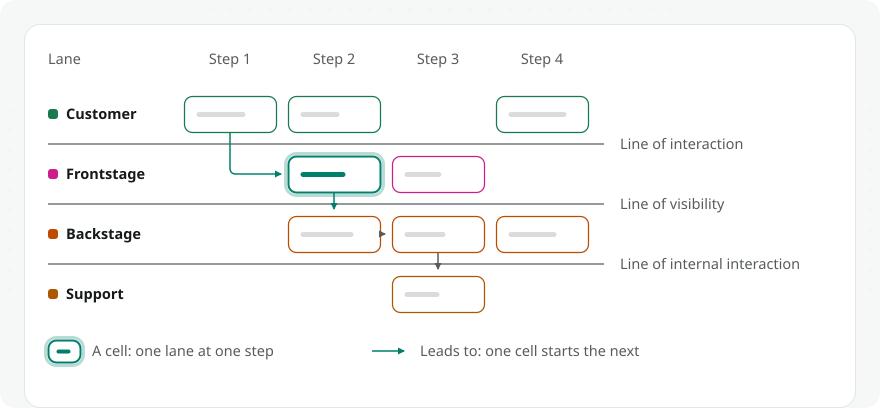

# Uno Blueprint

Turn a service blueprint from a static artifact into an operational source of truth: structured, queryable data that agents consult continuously. **It stops being a poster and becomes a database.**

This repo is that idea, working end to end — two things in one:

1. **The `ub` Claude Code plugin** — four skills, in the order a team meets them. `ub:map` builds a blueprint from whatever you have: documents, a working session, or a diagram exported from somewhere else. `ub:audit` runs a roster of consistency checks over it. `ub:whatif` traces a proposed change before anyone commits to it. `ub:slice` takes the view one audience needs out of it.
2. **An org-agnostic frontend and backend template** that `ub:map` deploys onto — React + Vite + [shadcn/ui](https://ui.shadcn.com/) grid renderer and a [Supabase](https://supabase.com/) schema, with dependency arrows, comparison views, and print/PDF export.

## Why a queryable blueprint

<picture>
  <source media="(prefers-color-scheme: dark)" srcset="./docs/assets/why-now.dark.svg">
  
</picture>

Service blueprints have traditionally been strategic artifacts rather than day-to-day reference tools. Partly because they are expensive to use: interpreting one takes facilitation, workshops, and built-up context, so teams engage with them occasionally, not daily. Agents change that constraint. An agent can consult the blueprint continuously, grounding each recommendation in the full journey and checking proposed changes against the wider service, without adding work for the team.

What that buys you:

- **It gives agents the service context they are otherwise missing.** Most context-engineering approaches hand the agent piles of documents that each describe part of the product. The blueprint gives it a coherent model of the whole service: the user journey, frontstage and backstage activity, supporting systems, and the relationships between them.
- **It improves everyday product work.** With that context, an agent writes clearer PRDs, scopes projects more precisely, locates where a change sits within the service, and reasons about downstream effects.
- **It creates a shared lens for people and agents.** The blueprint does more than add facts — it pushes the agent to reason through a service-design frame, and grounds the team's own thinking in that same frame.
- **It makes the blueprint continuously used.** Because the agent depends on it daily, the team has a practical reason to keep it accurate. Operational use strengthens its value as a strategic artifact rather than replacing it.

## See it live

- **Run it yourself** — `npm create uno-blueprint@latest` writes a workspace and installs it, and `npm run dev` inside it boots the stock renderer over the bundled sample blueprint, no database needed: phases, path comparisons on one shared step axis, dependency arrows, and cell detail panels. Click any phase, then flip between paths. See [Run locally](#run-locally) below.

Demos of the blueprint in use (recordings coming soon):

- *Agent in the IDE* — Claude Code scopes a feature against the blueprint: finding the moment the change lands, then tracing what it reaches. *(placeholder)*
- *Inline agent* — a chat agent answers a service question ("where does approval happen?") and cites the cells it answered from. *(placeholder)*
- *Reading it as a person* — walking the phases, flipping path variants, opening cell detail panels. *(placeholder)*

## The plugin

### What it does

Install the repo as a Claude Code plugin, then ask Claude to map a service — "turn our FigJam service map into a deployed blueprint", "blueprint how our support process works". `ub:map` routes by what exists: nothing → co-create from conversation; docs → ingest with per-cell provenance; a foreign structured diagram → translate via crosswalk; an existing workspace → resume/update.

The pipeline in one line:

**sources → one validated blueprint file → preview + adversarial review → per-scenario sign-off → import** (no-database fallback or live Supabase) **→ verify + deploy**

### How it works

<picture>
  <source media="(prefers-color-scheme: dark)" srcset="./docs/assets/skill-architecture.dark.svg">
  
</picture>

*Four skills, each carrying its own playbooks and scripts and linking only the shared references its task needs. The heavy reading happens in **fresh-context agents** — `document-reader` over the sources, `blueprint-reviewer` over the draft, `auditor` one check at a time, `impact-tracer` down the dependency graph — each returning a thin summary rather than its raw material. Every phase ends at a deterministic gate, never at "looks done".*

### The four skills

| Skill | What it is for | Where it ends |
| --- | --- | --- |
| [`ub:map`](./skills/map/SKILL.md) | create a blueprint, import documents, translate a foreign diagram, resume an existing workspace | a validated `blueprint/blueprint.json`, signed off per scenario |
| [`ub:audit`](./skills/audit/SKILL.md) | run the check roster over a blueprint | findings you triage, nothing changed for you |
| [`ub:whatif`](./skills/whatif/SKILL.md) | trace a proposed change before anyone commits to it | the cells it would reach, on a copy |
| [`ub:slice`](./skills/slice/SKILL.md) | take a stakeholder view out of the blueprint: `journey`, `step`, `lane`, `cell`, `custom` | a slice document that still points at the cells it cites |

Each is walked, with its own figure, in [guide/03 — The plugin](./docs/guide/03-the-plugin.md).

### In other coding agents

The repo ships the four skills under `.agents/skills/` as well, so a checkout or a workspace works in coding agents that read that folder, with no plugin install. Checked by hand:

| Agent | How you call a skill |
| --- | --- |
| Cursor | `ub:map`, or describe a map task |
| Codex | `$ub:map` |

Gemini CLI, Copilot and Windsurf document the same `.agents/skills/` convention and are expected to find the skills too. What the mirror is, and why you edit `skills/` and sync: [guide/03 § In other coding agents](./docs/guide/03-the-plugin.md#5-in-other-coding-agents).

## Where the blueprint is used

<picture>
  <source media="(prefers-color-scheme: dark)" srcset="./docs/assets/four-ways-in.dark.svg">
  
</picture>

The app is where people read, compare, and present. The in-app agent drafts changes in place; it asks you to sign in and bring your own model key. Your agentic tools reach the same rows from your IDE or CLI. The template ships those three, and all of them work from one shared context layer, so what any of them reads is what the others wrote. The fourth, dashed, is a pattern rather than a component: nothing here is a Slack bot. A chat surface over the blueprint can read what a deployment publishes, holding only the publishable key, and answer with links back to the exact cell; what it has to honour is the read-consumer section of the adapter contract, [references/adapter-contract.md](./references/adapter-contract.md#read-consumers-bots-agent-tools-external-integrations), and [guide/02](./docs/guide/02-using-it-in-practice.md) describes the shape. Who may do what follows from the account each one uses: see [guide/04 — Operations](./docs/guide/04-operations.md).

## The blueprint model

### How a blueprint is organized

<picture>
  <source media="(prefers-color-scheme: dark)" srcset="./docs/assets/data-model-hierarchy.dark.svg">
  
</picture>

*Read top to bottom — each level opens the one marked above it: a **service** holds ordered **phases** (which can loop back via `loops_to_phase_id`); a phase holds **scenarios**; a scenario holds **path** variants; each path is a lanes × steps grid of **cells**.*

### Inside one path

<picture>
  <source media="(prefers-color-scheme: dark)" srcset="./docs/assets/blueprint-anatomy.dark.svg">
  
</picture>

*Lanes are rows — one actor each, colored by semantic `lane_role` (labels are free-form, any language). Steps are columns — time runs left to right. A **cell** is what one actor does at one moment; **dependencies** are "this cell starts that one" arrows between cells. The lines of **interaction**, **visibility** and **internal interaction** are derived from roles, so each falls between the lanes it separates (touchpoint lanes render their cells as touchpoints in the app).*

*Two levels down — what a single cell holds, and how a slice is taken out of the blueprint — are in [guide/01 — The blueprint model](./docs/guide/01-the-blueprint-model.md).*

### Key semantics

- **`lanes.lane_role`** — rendering (colors, touchpoint cells, divider lines) is driven by a semantic role key (`customer_actions`, `frontstage_actions`, `backstage_actions`, `partner_actions`, `frontstage_touchpoints`, `backstage_touchpoints`, `support_actions`, `storyboard`), never by the display name — lane labels are free-form in any language. The set is closed by `lanes_lane_role_check`; `null` renders as a generic swimlane. Contract: [`src/lib/laneRoles.ts`](./src/lib/laneRoles.ts).
- **Steps are scenario-scoped columns** shared across paths via `path_steps` ordering — see [references/data-model.md](./references/data-model.md).
- **Import order** (enforced by the `cells_validate_path_match` trigger): `paths → steps → path_steps → lanes → cells → cell_dependencies`.
- **Layouts** per scenario: `layout` is `stacked` (one full band per path on a shared step axis) or `merged` (the paths combined into one blueprint). The header toggle stores it, so a scenario left merged opens merged. `single` became `stacked` in `21000117000000`; `side-by-side` and `integrated` became `stacked` in `21000116000000`.

Full detail when you need it: [docs/connectors/supabase/database.md](./docs/connectors/supabase/database.md) (column reference) · [docs/erd.mmd](./docs/erd.mmd) (attribute-level ERD).

## Get set up

Hand this section to your agent — it can run all of it. Each subsection also works as manual steps.

### Run locally

One command writes a workspace — the whole template, at the release that matches the command's own version — installs its dependencies, and prints the lines that start the canvas. Use the package manager you already have:

```bash
npm create uno-blueprint@latest
pnpm create uno-blueprint
yarn create uno-blueprint   # Yarn 1
bun create uno-blueprint
```

Then start it, in the same manager's words:

```bash
cd uno-blueprint
npm run dev                 # or: pnpm dev · yarn dev · bun dev
```

No database needed — this renders the bundled sample blueprint so you can see the frontend working before wiring anything up.

It needs Node 22 or later. Which package managers work, what each installs, and the command's options are in [SETUP.md § 1](./SETUP.md#1-start-a-workspace).

To work on the template itself, clone it instead:

```bash
git clone https://github.com/BilLogic/uno-blueprint.git
cd uno-blueprint
npm install
npm run dev
```

With no `VITE_SUPABASE_*` env vars the app runs in **no-DB mode** and renders the bundled sample content — generated by [`scripts/generate_sample_blueprint.mjs`](./scripts/generate_sample_blueprint.mjs) into both `src/data/sampleBlueprint.ts` (offline fallback) and `supabase/seed.sql` (database seed).

### Add a database

```bash
cp .env.example .env
npm run supabase:start       # local stack (Docker)
npm run supabase:reset       # applies migrations + sample seed
npm run dev
```

Copy `API URL` and `anon key` from the CLI output into `.env`. For a hosted project: `supabase link`, `supabase db push`, then `supabase db query --file supabase/seed.sql --linked`, and set `.env` from **Settings → API**.

Then `npm run check:target` — it asks the database which schema it carries. Run it once: the app falls back to bundled content when it cannot reach a project, so "the page renders" does not mean the migration ran.

> **Exposure note:** all tables carry public `SELECT` policies (read-only anon access). Anything you deploy is publicly readable — don't load client-sensitive content into a public deployment.

### Bring your own backend

**The portable Postgres core is the contract. Supabase is one conformant reference recipe — fully supported, and not the requirement.**

That partition is not a stance in a comment any more; it is two generated files and a CI job. The migrations carry the marks, [scripts/generate-portable-core.mjs](./scripts/generate-portable-core.mjs) emits both halves from them, and every pull request applies the core to a stock `postgres:17` with no Supabase in front of it, then the recipe on top. If the core stops being portable, the build goes red.

| | |
| --- | --- |
| [supabase/generated/portable-core.generated.sql](./supabase/generated/portable-core.generated.sql) | **The contract.** Tables, columns, constraints, indexes, views, triggers, function bodies. Runs on any Postgres. |
| [supabase/generated/supabase-recipe.generated.sql](./supabase/generated/supabase-recipe.generated.sql) | **One recipe.** `auth.uid()` defaults, the anon / authenticated / service_role grants, RLS policies, the storage bucket. This is what the shipped app runs on. |
| [supabase/generated/portable-core.schema.sql](./supabase/generated/portable-core.schema.sql) | **The same core, as the database it builds.** `pg_dump --schema-only` of a stock Postgres that replayed the series, carrying only the names a backend ends up holding. The series is what you apply; this is what you read, and what the vocabulary checks read. |

All three are generated. Edit a migration and run `npm run generate:portable-core` and `npm run generate:portable-schema`; a hand-edit is reverted by CI. Another host writes its own recipe against the same core and is exactly as conformant — that is what the partition is for.

**What the app actually reads and writes through** is the generated database type, [`src/types/database.ts`](./src/types/database.ts) — every table, column and RPC signature the core declares, emitted from the migrations and re-checked by CI. That is the seam that varies between this template and a deployment, and it is the one the compiler holds: change the core, regenerate the type, and every call site that no longer agrees stops building.

**What a store has to answer** to serve this app live — every operation, and the guarantee on each — is [references/adapter-contract.md](./references/adapter-contract.md) § Live backend surface.

**What you get to copy**: the portable core ([supabase/generated/portable-core.generated.sql](./supabase/generated/portable-core.generated.sql) + [docs/erd.mmd](./docs/erd.mmd)), applied to a stock Postgres in CI; the normative spec in [references/adapter-contract.md](./references/adapter-contract.md); and the shipped Supabase call sites to read as the worked example.

**What we don't provide** — stated as a boundary rather than a list of apologies, so you know where your work starts:

- **No auth beyond the anon / authenticated split.** The tier reader ([`src/lib/identity.ts`](./src/lib/identity.ts)) asks the database one question — what may this session do — and leaves how you answer it to you. Supabase Auth is the shipped recipe, not the requirement.
- **No multi-tenancy.** One blueprint workspace per database. There is no tenant column, and RLS does not scope by one.
- **No backup or restore.** Your host's problem, and the reason `supabase/migrations/` is append-only: an undo is a new migration.
- **No migration ops beyond the shipped chain.** `db push` and `db reset` are supported; anything past that — branching, squashing, multi-environment promotion — is yours. The one operational failure we do own is desync, with a runbook: [docs/connectors/supabase/database.md § Migration desync](./docs/connectors/supabase/database.md).
- **No adapter for your backend, and no hosting.**

**What answers "is it actually wired up"**: `npm run check:target` asks the live database which schema it carries and tells you whether it was never migrated, is stale, or is fine — [docs/connectors/supabase/database.md § Did the migration run](./docs/connectors/supabase/database.md). Worth running once: without a configured project the app falls back to bundled content and renders perfectly, so a misconfigured target looks exactly like a working one.

**What you start from**: `supabase/seed.sql` is the **META-BLUEPRINT** — the service blueprint of this template itself, not filler. One generator emits it and the no-DB fallback module from the same source, so both adapters serve the same content. Replace it with your own service; until then it doubles as the documentation.

### Deploy

`netlify.toml` at the repo root carries the build command, `dist/` publish dir, node version, and the redirect table — a 404 for `/assets/*` above the SPA fallback (`/* /index.html 200`). `public/_headers` carries the CSP and the one-year immutable cache for `/assets/*`. Both files are held by `npm run check:hosting`. Any static host works — the build always produces a plain `dist/`; live-DB mode needs `VITE_SUPABASE_URL` / `VITE_SUPABASE_ANON_KEY` at **build time**. Blueprint-specific deploy gotchas: [skills/map/references/deploy-notes.md](./skills/map/references/deploy-notes.md).

**Serving from a path** (`https://example.org/demo/` rather than a domain root): set `BASE_PATH=/demo/` at build time. The output then lands in `dist/demo/`, every URL the app reads or writes keeps the prefix, and the build writes the redirect and cache rules for `/demo/` into `dist/`. The rules, and the one-line Netlify rewrite for showing the app under a path on another site, are in [guide/04 § Serving from a path](./docs/guide/04-operations.md#serving-from-a-path).

### Connect your agents

- **In the IDE** — install this repo as a Claude Code plugin (manifest: [.claude-plugin/plugin.json](./.claude-plugin/plugin.json)). That loads the four skills, five agents, and the hooks: Claude can then build, review, import, and update blueprints in your workspace. Cursor and Codex find the four skills in a checkout on their own: [In other coding agents](#in-other-coding-agents).
- **Everywhere else (a Slack bot you build, an assistant, any agent you run)** — the template ships none of these, but a deployed blueprint publishes its rows for reading, so an agent holding only the publishable key can query them and answer with links back to individual cells. What a backend has to satisfy to work this way is the adapter contract: [references/adapter-contract.md](./references/adapter-contract.md), walked in [guide/03](./docs/guide/03-the-plugin.md).

## Reference

### Scripts

| Command | Description |
| --- | --- |
| `npm run dev` | Vite dev server |
| `npm run build` | Typecheck + production build |
| `npm run lint` | ESLint |
| `npm run supabase:start` / `stop` / `reset` | Local Supabase stack |
| `npm run generate:database-types` / `check:database-types` | Regenerate `src/types/database.ts` from the database the portable core builds, or diff it against what is committed |
| `node scripts/generate_sample_blueprint.mjs` | Regenerate the sample content (fallback module + seed) |
| `python3 scripts/validate_ir.py <blueprint.json>` | Validate a blueprint file (stdlib-only) |
| `python3 scripts/generate_fallbacks.py <blueprint.json> --locale <tag> --register` | blueprint → no-database data module + offline nav, into this repository's own marker blocks |
| `python3 scripts/generate_fallbacks.py <blueprint.json> --locale <tag> --registry-out <path> --nav-out <path>` | the same two halves as standalone modules, for a deployment that mounts this package |
| `python3 scripts/generate_seed_sql.py <blueprint.json> --locale <tag>` | blueprint → transactional Supabase seed |
| `python3 scripts/compute_signoff_hash.py <blueprint.json>` | Per-scenario sign-off content hashes |
| `python3 skills/audit/scripts/audit_tools.py` | Helpers the audit checks run on |
| `python3 skills/slice/scripts/slice_tools.py` | Helpers for composing and validating a slice |
| `npm run check:target` | Ask the configured database which schema it carries |
| `npm test` | Vitest suite for the app |
| `bash scripts/tests/run_tests.sh` | Round-trip test suite for the blueprint pipeline |

### Repo map

| Path | Purpose |
| --- | --- |
| [INDEX.md](./INDEX.md) | Where to find things — routes by task, generated from the docs' frontmatter |
| [CONTEXT.md](./CONTEXT.md) | The domain language: scenario, path, phase, step, cell, lane, the visibility line, dependency, need, slice, finding |
| [SETUP.md](./SETUP.md) | Getting the repository running, and the checks to run before pushing |
| [AGENTS.md](./AGENTS.md) | The agent router — which skill answers which intent |
| [.claude-plugin/plugin.json](./.claude-plugin/plugin.json) | Claude Code plugin manifest — this is what makes the repo installable as a plugin |
| [skills/](./skills/) | Four skills, one directory each (`map`, `slice`, `audit`, `whatif`): `SKILL.md` entry point plus that skill's own `references/` (playbooks, schemas, check docs) and `scripts/` |
| [agents/](./agents/) | Five subagents: `document-reader`, `blueprint-reviewer` (adversarial pre-sign-off review), `render-checker`, `auditor` (one check at a time, blind to the others), `impact-tracer` (walks the dependency graph) |
| [references/](./references/) | Shared core every skill uses: data model, blueprint schema, adapter contract, canvas adapter, lane-role & lane vocabularies, the interface→schema map, customization, audit playbook |
| [scripts/](./scripts/) | Shared blueprint pipeline: validator, fallback + seed generators, sign-off hasher, tests |
| [hooks/](./hooks/) | Session status, blueprint auto-validation on edit, service-role secret guard |
| `src/components/blueprint/` | Blueprint grid, paths, dependency arrows (shadcn/ui + Tailwind v4) |
| [src/styles/](./src/styles/) | The token layers, in the order they resolve: `colors.css` (the ramps), `semantic.css` (what each colour is *for*), `theme.css` (the Tailwind bindings), `themes/` (light and dark) |
| `src/lib/classList.ts`, `typeWeight.ts`, `typeInk.ts` | The type doctrine, enforced rather than described: one working weight, 600 for headings only, and ink named as a rung instead of dialled as an opacity. Each failure names the rung or weight to write instead. [ADR 0012](./docs/adr/0012-a-rung-owns-size-and-leading.md) |
| `src/components/editor/` | Canvas/slide editor shell |
| [src/lib/laneRoles.ts](./src/lib/laneRoles.ts) | `lane_role` rendering contract |
| [src/data/blueprintFallbacks.ts](./src/data/blueprintFallbacks.ts) | Offline/no-DB fallback registry (sample content) |
| [supabase/migrations/](./supabase/migrations/) | Schema migrations — base template plus the authoring and agent-surface layers |
| [supabase/seed.sql](./supabase/seed.sql) | Generated sample seed |
| [supabase/generated/](./supabase/generated/) | The portable core and the Supabase recipe, generated from the migrations' partition marks |
| [docs/guide/](./docs/guide/) | The four guides: the model, using it, the plugin, operations |
| [docs/adr/](./docs/adr/) | The decisions, numbered. The list is [docs/adr/overview.md](./docs/adr/overview.md) |
| [docs/connectors/supabase/](./docs/connectors/supabase/) | The reference recipe as an operated database: columns, row-level security, the migration desync runbook |
| [docs/engineering/](./docs/engineering/) | Cutting a release, and every guard behind a red build |
| [docs/guidelines/](./docs/guidelines/) | Writing documentation here, and proposing a change |
| [docs/assets/](./docs/assets/) | Every figure in this README and the guides |
| [docs/erd.mmd](./docs/erd.mmd) | Attribute-level ERD |

## Going deeper

| Guide | Who it is for | What it answers |
| --- | --- | --- |
| [01 — The blueprint model](./docs/guide/01-the-blueprint-model.md) | anyone reading or authoring a blueprint | what exactly am I looking at? |
| [02 — Using it in practice](./docs/guide/02-using-it-in-practice.md) | the designer or PM deciding how this fits their week | what do I actually do with it? |
| [03 — The plugin](./docs/guide/03-the-plugin.md) | the adopter installing it, the engineer extending it | how does the machinery work, and what lands on my disk? |
| [04 — Operations](./docs/guide/04-operations.md) | whoever runs it | who may do what, and what happens when it changes? |

Everything else — every document with what it answers, and the routing table
an agent matches its task against — is [INDEX.md](./INDEX.md), with
[docs/overview.md](./docs/overview.md) for what the folders mean. Work in
flight lives in
[issues](https://github.com/BilLogic/uno-blueprint/issues)
rather than in the tree, so you can see what is already being worked on before
proposing something.
