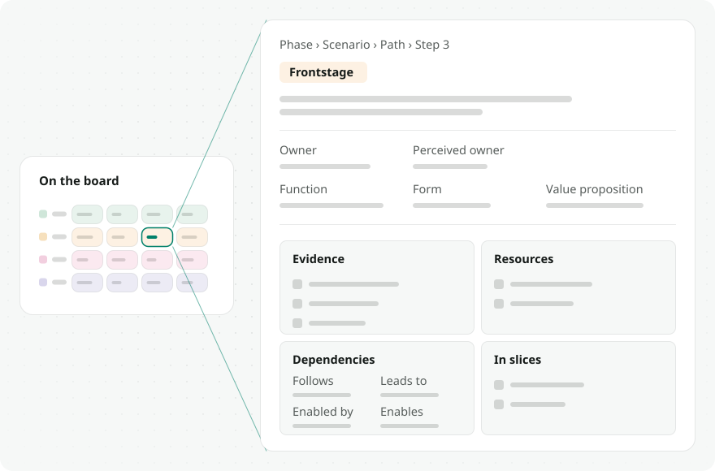
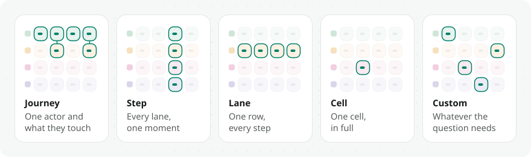

# The blueprint model

**For** anyone who will read or author a blueprint.
**Answers** what exactly am I looking at?

## 1. The hierarchy

<picture>
  <source media="(prefers-color-scheme: dark)" srcset="../assets/data-model-hierarchy.dark.svg">
  
</picture>

A **service** holds ordered **phases**. A phase can loop back to an
earlier one (`loops_to_phase_id`), which is how renewals and repeat visits
are modelled without duplicating the journey.

A phase holds **scenarios** — the distinct situations a customer can be in.
A scenario holds **paths**: variants of the same situation, such as the
happy path and the one where the payment fails.

**Steps are scenario-scoped columns.** They are canonical per scenario;
each path *includes* a subset of them and assigns its own column order
through `path_steps` (the full model is in
[`references/data-model.md`](../../references/data-model.md)). Two paths in one scenario therefore
line up column by column, which is what makes side-by-side comparison
meaningful rather than approximate.

## 2. Lanes and roles

<picture>
  <source media="(prefers-color-scheme: dark)" srcset="../assets/blueprint-anatomy.dark.svg">
  
</picture>

Lanes are rows, one actor each. Steps are columns, time running left to
right. Rendering is driven by `lanes.lane_role`, a semantic key, never by
the lane's display name — so lane labels are free-form, in any language,
and a blueprint in Chinese renders exactly like one in English.

| `lane_role` | Row |
| --- | --- |
| `customer_actions` | what the customer does |
| `frontstage_actions` | what staff do in view of the customer |
| `frontstage_touchpoints` | the touchpoints the customer meets |
| `backstage_actions` | what staff do out of view |
| `backstage_touchpoints` | the touchpoints only staff meet |
| `support_actions` | the teams, vendors and infrastructure behind the work |
| `partner_actions` | a party outside the service, acting in view |
| `storyboard` | imagery for each step |

The role set is closed; `null` renders as a generic swimlane. The **line of
interaction** and **line of visibility** are derived from these roles
rather than drawn by hand, so they cannot drift out of agreement with the
lanes they separate.

## 3. Cells

<picture>
  <source media="(prefers-color-scheme: dark)" srcset="../assets/cell-anatomy.dark.svg">
  
</picture>

A cell is what one actor does at one step. Beyond its content it carries:

- **Owner** and **perceived owner.** Kept separately because the
  interesting case is when they differ: the customer thanks a team that was
  not accountable for the moment.
- **Function, form, value proposition.** What it has to accomplish, how it
  comes across, and who gets what from it.
- **Dependencies.** `Follows` and `Leads to` are the two ends of the arrow
  drawn on the grid. `Enabled by` and `Enables` are the two ends of a
  dependency with no arrow: the source makes the target possible without
  being what makes it happen.
- **Evidence.** The sources the cell rests on. A cell with none reads as an
  assumption, which is a finding rather than a gap in the tooling.
- **Resources.** What the cell points at: links, and files uploaded from the
  tab itself (they land in Storage, and the row carries the file's URL). Their
  rows and ownership live in the
  [data model](../../references/data-model.md#tables-in-brief).
- **Slices.** Which slices quote this cell.

## 4. Slices

<picture>
  <source media="(prefers-color-scheme: dark)" srcset="../assets/slicing-model.dark.svg">
  
</picture>

A slice is a lens on the blueprint, not a copy of it. Its slides point at
live cells, so updating a cell updates every slice that quotes it, and a
re-import leaves slices intact because they refer to cells by key rather
than by position.

Five ways to slice, from `slice-schema.json`:

| Type | What it holds |
| --- | --- |
| `journey` | one actor's path, summarized |
| `step` | one step, top to bottom across every lane |
| `lane` | one lane, left to right across the service |
| `cell` | one cell, in full |
| `custom` | whatever the question needs |

Each has a document template in
[`skills/slice/references/slice-templates.md`](../../skills/slice/references/slice-templates.md).

A slice is read in two places: **on the canvas**, where it is the blueprint
with everything else dimmed, and **in presentation**, one frame at a time
on a dark surface with a filmstrip and a locator. Same slice, two ways of
looking at it.

## 5. Layouts

Per scenario, `layout` is `stacked` (one full band per path on a shared step
axis — any labelled variants, such as designed versus reality, compared slot
by slot) or `merged` (the compared paths drawn as one grid: one lane rail,
one step axis, cells the paths agree on drawn once). The header toggle
stores the choice, so a scenario left merged opens merged. `single` became
`stacked` in `21000117000000` — one path stacked is one band — after
`side-by-side` and `integrated` became `stacked` in `21000116000000`.
Comparison is per slot, so a difference in one cell is a difference you can
point at.
