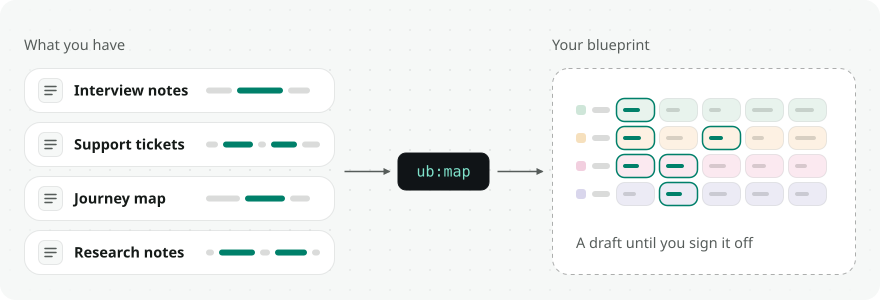
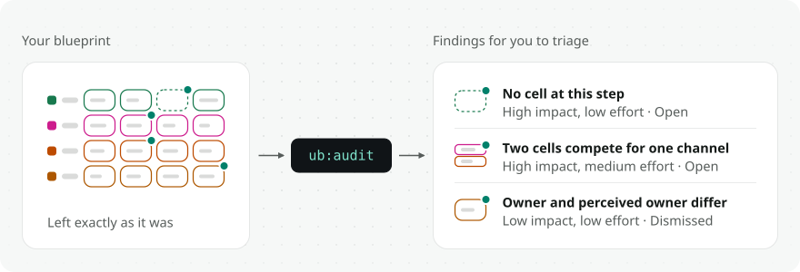
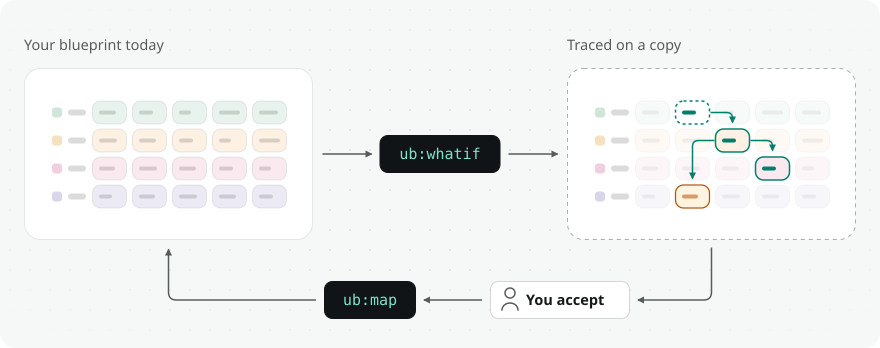
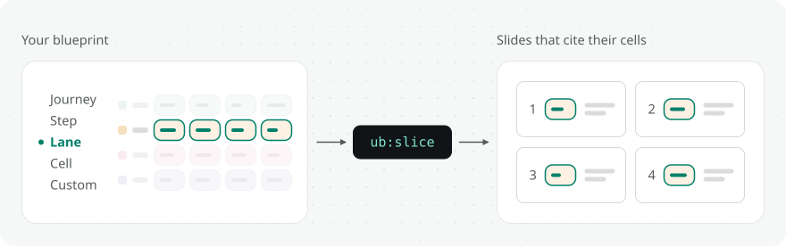

# The plugin

**For** the adopter installing it and the engineer extending it.
**Answers** how does the machinery work, and what lands on my disk?

## 1. The four skills

They are listed here in the order a team meets them, which is the order the
sample blueprint's own scenarios run in: map a service, audit what is on the
board, trace a change through it, then cut the view an audience asked for.

### `ub:map`

<picture>
  <source media="(prefers-color-scheme: dark)" srcset="../assets/ub-map.dark.svg">
  
</picture>

Fires when you ask for a blueprint to be created, imported, translated or
resumed. It routes by what already exists: nothing at all becomes
co-creation from conversation; documents become an ingest with per-cell
provenance; a foreign structured diagram becomes a translation through a
crosswalk; an existing workspace resumes where it stopped.

Its exit is not "looks done": a validated `blueprint/blueprint.json`, an
adversarial review that came back clean, and a per-scenario sign-off bound
to a content hash.

### `ub:audit`

<picture>
  <source media="(prefers-color-scheme: dark)" srcset="../assets/ub-audit.dark.svg">
  
</picture>

Runs the check roster. Each check is dispatched to its own agent that sees
only that check's doc and the export, so no check can be influenced by
another's conclusion. Exits with findings for you to triage; it never
edits the blueprint.

### `ub:whatif`

<picture>
  <source media="(prefers-color-scheme: dark)" srcset="../assets/ub-whatif.dark.svg">
  
</picture>

Takes a proposed change and traces it on a copy: which cells it reaches,
which assumptions stop holding, where displaced demand lands. Exits with
options, not edits. Accepting one promotes it through `ub:map`.

### `ub:slice`

<picture>
  <source media="(prefers-color-scheme: dark)" srcset="../assets/ub-slice.dark.svg">
  
</picture>

Takes one stakeholder view out of the blueprint as a document. Five types,
each with a template. Exits when the slice validates and every claim in it
traces to a cited cell.

## 2. The skills and the agents

<picture>
  <source media="(prefers-color-scheme: dark)" srcset="../assets/skill-architecture.dark.svg">
  
</picture>

Each skill carries its own `references/` and, where it needs them,
`scripts/`. It links only the shared references its task needs rather than
loading all of them: `ub:map` links six, `ub:audit` six, `ub:whatif` five,
`ub:slice` four.

The heavy reading happens elsewhere. Five agents run in their own context
and hand back a summary rather than their raw material:

| Agent | Job |
| --- | --- |
| `document-reader` | reads source documents and returns structure |
| `blueprint-reviewer` | adversarial review of a draft before sign-off |
| `render-checker` | walks every scenario in the deployed app |
| `auditor` | executes exactly one check, blind to the others |
| `impact-tracer` | walks the dependency graph downstream of a change |

## 3. From your documents to a blueprint

Sources in, one validated blueprint file out, then its companions:

| File | What it is |
| --- | --- |
| `blueprint/blueprint.json` | the blueprint itself, validated against `ir-schema.json` |
| `blueprint-workspace.json` | cross-phase state: per-scenario status, sign-off hashes, import targets |
| `src/data/blueprintFallbacks.ts` | generated no-database module |
| `supabase/seed.sql` | generated transactional seed |

## 4. Your own backend

The app does not require Supabase. What any backend must satisfy is set out
in [`references/adapter-contract.md`](../../references/adapter-contract.md),
which is normative: the read shape, the write path, and the access rules.
The worked path is to hand that document to your agent and ask it to
implement the contract against your stack.

## 5. In other coding agents

Several coding agents look for skills under `.agents/skills/<name>/SKILL.md`
rather than in a top-level `skills/`. So the repo carries a mirror: each
skill's `SKILL.md`, copied byte for byte into `.agents/skills/map/`,
`slice/`, `audit/` and `whatif/`. Open a checkout or a workspace in one of
those tools and the four skills are there, with no plugin to install.

Cursor and Codex were checked by hand, and both showed the skills under
their `ub:` names. In Cursor a skill is `ub:map`, or you describe a map
task; in Codex it is `$ub:map`. A bare `map` is not registered in either.
Gemini CLI, Copilot and Windsurf document the same `.agents/skills/`
convention, so they are expected to find the skills as well; how each one
names and calls them has not been checked.

`skills/` stays the source, for two reasons. Its paths are a published
interface: the deployment imports them by fixed path from a pinned tag, so
moving them is a version bump and a matching change on the deployment's side
([ADR 0004](../adr/0004-reference-paths-are-a-published-interface.md)). And
only `SKILL.md` needs to be in the mirror, because every path a skill names
resolves from the repository or workspace root, so its references, scripts
and agents are found where they already are. The mirror is a copy, not a
link, because the initialiser refuses a release tarball that holds a link.

After editing a skill, run `npm run sync:skills`. It refreshes the mirror
and the copy the app bundles under `src/lib/agent/skill/`. `npm test` runs
the same sync with `--check` first, and fails on a copy that drifted, a copy
that is missing, or a file under `.agents/skills/` that no skill produced,
naming the file. Editing the mirror directly is lost on the next sync.
